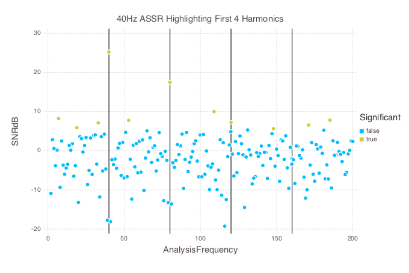

# EEG

[](https://travis-ci.org/codles/EEG.jl)
[](https://coveralls.io/r/codles/EEG.jl?branch=master)

Process EEG files in Julia.  
**This package is not tested. Use at your own risk**  

## Description

This package includes low level processing functions (filtering, referencing, statistics etc).  
It also includes types for various EEG measurments (ASSR, ABR etc) and wrapper functions to process these files using the lower level functions.

## Example

```python

using EEG
using DataFrames
using Gadfly
using Logging
Logging.configure(level=INFO)


# Read file and pre processing
a = read_ASSR("Example-40Hz.bdf")
a = highpass_filter(a)
a = rereference(a, "Cz")
a = merge_channels(a, EEG_Vanvooren_2014, "Merged")
    remove_channel!(a, EEG_64_10_20)


# Run an F-test and save data
a = extract_epochs(a)
a = create_sweeps(a)
a = ftest(a, [2:200])
a = ftest(a, float(a.modulation_frequency)*[1, 2, 3, 4])
a = save_results(a)


# Read the saved data and plot with Gadfly.jl
df = readtable("Example-40Hz.csv")
df[:Significant] = df[:Statistic] .< 0.05

p = plot(df, x="AnalysisFrequency", y="SNRdB", color="Significant",
             xintercept=float(a.modulation_frequency)*[1, 2, 3, 4],
             Geom.vline(color="black"), Geom.point,
             Guide.title("40Hz ASSR Highlighting First 4 Harmonics"),
             Guide.xlabel("Frequency (Hz)"), Guide.ylabel("SNR (dB)"),
             Scale.discrete_color_manual("red","green"))

draw(PNG("Example-40Hz.png", 18cm, 12cm), p)


```


Results in the following figure which displays the SNR at each frequency.
The vertical lines highlight the harmonics of the stimulus and color represents if a significant response was detected.




## Functions

Currently there are function for the following processes on raw data and ASSR types

#### Preprocessing
- filtering  
- re-referencing
- epoch and sweep extraction
- epoch rejection based on peak to peak amplitudes

#### Statistics
- ftest

#### File IO
- *.dat

## Installation

Requires:
- BDF
- DSP
- Winston
- DataFrames
- ProgressMeter
- Logging
  
Pkg.clone("git://github.com/codles/EEG.jl.git")


